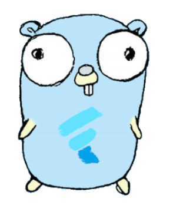
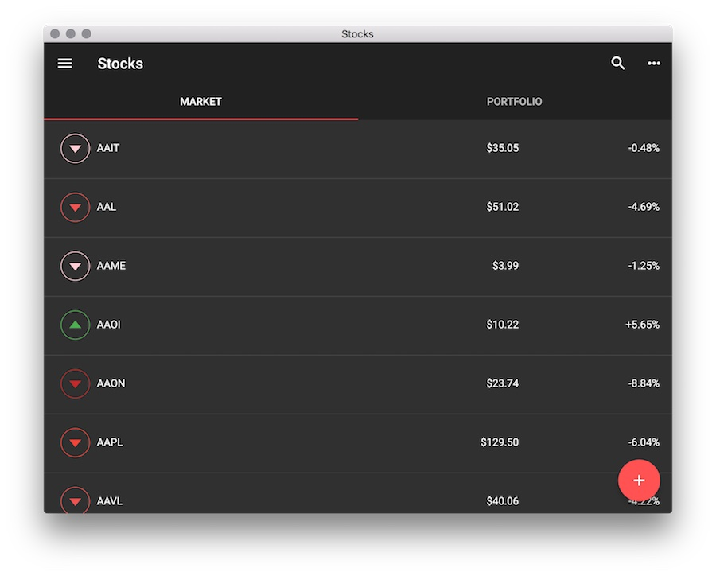

# go-flutter - A package that brings Flutter to the desktop

## Purpose

[Flutter](http://flutter.io/) allows you to build beautiful native apps on iOS and Android from a single codebase.

This [unofficial](https://github.com/go-flutter-desktop/go-flutter/issues/191#issuecomment-511384007) project brings Flutter to the desktop through the power of [Go](http://golang.org/) and [GLFW](https://github.com/go-gl/glfw).

The flutter engine itself doesn't know how to deal with desktop platforms _(eg handling mouse/keyboard input)_. Instead, it exposes an abstraction layer for whatever platform to implement. This project implements the [Flutter's Embedding API](https://github.com/flutter/flutter/wiki/Custom-Flutter-Engine-Embedders) using a single code base that runs on Windows, MacOS, and Linux. For rendering, [**GLFW**](https://github.com/go-gl/glfw) fits the job because it provides the right abstractions over the OpenGL's Buffer/Mouse/Keyboard for each platform. 

The choice of [Golang](https://github.com/golang/go) comes from the fact that it has the same tooling on every platform. Plus Golang is a great language because it keeps everything simple and readable, which makes it easy to build cross-platform plugins.

  

## Getting started

The best way to get started is to install [hover](https://github.com/go-flutter-desktop/hover), the official go-flutter tool to set up, build and run Flutter apps on the desktop, including hot-reload.

Read the [hover tutorial](https://github.com/go-flutter-desktop/hover) to run your app on desktop, or start with [one of our example apps](https://github.com/go-flutter-desktop/examples).

If you want more in-depth information about go-flutter, read the [wiki](https://github.com/go-flutter-desktop/go-flutter/wiki).

## Supported features

- Linux :penguin:
- MacOS :apple:
- Windows :checkered_flag:
- **Hot Reload**
- Plugin system
  - BinaryMessageCodec, BinaryMessageChannel
  - StandardMessageCodec, JSONMessageCodec
  - StandardMethodCodec, **MethodChannel**
- Importable as Go library into custom projects
- UTF-8 Text input
- Clipboard copy & paste
- Window title and icon
- Standard keyboard shortcuts
  - <kbd>ctrl-c</kbd>  <kbd>ctrl-v</kbd>  <kbd>ctrl-x</kbd>  <kbd>ctrl-a</kbd>
  - <kbd>Home</kbd>  <kbd>End</kbd>  <kbd>shift-Home</kbd>  <kbd>shift-End</kbd>
  - <kbd>Left</kbd>  <kbd>ctrl-Left</kbd>  <kbd>ctrl-shift-Left</kbd>
  - <kbd>Right</kbd>  <kbd>ctrl-Right</kbd>  <kbd>ctrl-shift-Right</kbd>
  - <kbd>Backspace</kbd>  <kbd>ctrl-Backspace</kbd> <kbd>Delete</kbd>
- Mouse-over/hovering
- Mouse-buttons
- RawKeyboard events (through `RawKeyEventDataLinux` regardless of the platform)

Are you missing a feature? [Open an issue!](https://github.com/go-flutter-desktop/go-flutter/issues/new)

## Examples

A separate repository contains example Flutter apps that also run on the desktop. Go to [github.com/go-flutter-desktop/examples](https://github.com/go-flutter-desktop/examples) to give them a try.

## Plugins

Some popular plugins are already implemented over at [github.com/go-flutter-desktop/plugins](https://github.com/go-flutter-desktop/plugins).
If you have implemented a plugin that you would like to share, feel free to open a PR on the plugins repository!  

For a detailed tutorial on how to create a plugin, read the [wiki](https://github.com/go-flutter-desktop/go-flutter/wiki/Implement-a-plugin).

## Version compatibility

### Flutter version

Flutter itself is a relatively young project. Its framework and engine are updated often. The go-flutter project tries to stay compatible with the [beta channel](https://github.com/flutter/flutter/wiki/Flutter-build-release-channels) of Flutter.

### Go version

Updating Go is simple, and Go [seldomly has backwards incompatible changes](https://golang.org/doc/go1compat). This project remains compatible with the [latest Go stable release](https://golang.org/dl/).

### GLFW version

This project uses go-gl/glfw for GLFW v3.2.

## License

[BSD 3-Clause License](LICENSE)
